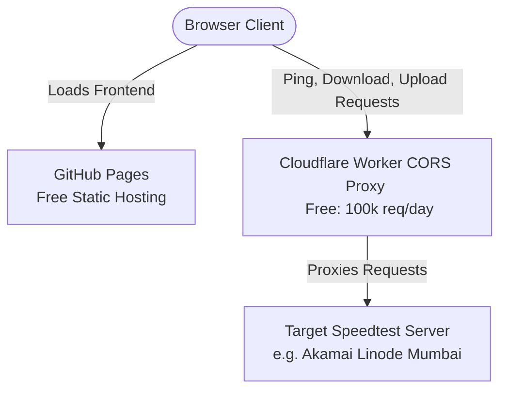

# Nebula Speedtest Free Hosting & CORS Proxy Deployment Guide

This guide details how to deploy both the **Nebula Speedtest Frontend** and the **CORS Bypass Proxy** completely for free using **GitHub Pages** and **Cloudflare Workers**.

---

## Architecture Overview



---

## Phase 1: Deploy the CORS Proxy on Cloudflare Workers (Free)

Cloudflare Workers provides 100,000 free requests per day, which is perfect for proxying speedtest measurements without paying for servers.

### 1. Create a Cloudflare Account
1. Go to [dash.cloudflare.com](dash.cloudflare.com) and register a free account.
2. In the sidebar, select **Workers & Pages** -> **Overview** -> **Create Application**.
3. Click **Create Worker**.
4. Name your worker (e.g., `nebula-cors-proxy`) and click **Deploy**.

### 2. Add the Proxy Code
1. Click **Edit Code** to open the Cloudflare Workers online code editor.
2. Replace the default template code with the following optimized proxy script:

```javascript
// Cloudflare Worker Transparent CORS Proxy
addEventListener('fetch', event => {
  event.respondWith(handleRequest(event.request))
})

async function handleRequest(request) {
  const url = new URL(request.url)
  
  // Extract target URL from query parameters (?url=...)
  const targetUrlStr = url.searchParams.get('url')
  if (!targetUrlStr) {
    return new Response(JSON.stringify({ error: "Missing 'url' parameter" }), {
      status: 400,
      headers: {
        "Content-Type": "application/json",
        "Access-Control-Allow-Origin": "*"
      }
    })
  }

  // Handle OPTIONS requests (CORS preflight)
  if (request.method === 'OPTIONS') {
    return new Response(null, {
      status: 200,
      headers: {
        'Access-Control-Allow-Origin': '*',
        'Access-Control-Allow-Methods': 'GET, POST, OPTIONS',
        'Access-Control-Allow-Headers': '*',
        'Access-Control-Max-Age': '86400'
      }
    })
  }

  try {
    const targetUrl = new URL(targetUrlStr)
    
    // Copy incoming request details to forward to the target
    const modifiedRequest = new Request(targetUrl, {
      method: request.method,
      headers: request.headers,
      body: request.method === 'POST' ? await request.arrayBuffer() : null
    })

    // Remove security headers that target servers might reject
    modifiedRequest.headers.delete('Host')
    modifiedRequest.headers.delete('Origin')
    modifiedRequest.headers.delete('Referer')
    
    // Perform fetch against target server
    const response = await fetch(modifiedRequest)
    
    // Build new response copy with wildcard CORS headers attached
    const corsHeaders = new Headers(response.headers)
    corsHeaders.set('Access-Control-Allow-Origin', '*')
    corsHeaders.set('Access-Control-Allow-Methods', 'GET, POST, OPTIONS')
    corsHeaders.set('Access-Control-Allow-Headers', '*')
    
    // Strip headers that interfere with transfer sizes
    corsHeaders.delete('Content-Encoding')
    corsHeaders.delete('Transfer-Encoding')
    
    return new Response(response.body, {
      status: response.status,
      statusText: response.statusText,
      headers: corsHeaders
    })
  } catch (err) {
    return new Response(JSON.stringify({ error: `Proxy failed: ${err.message}` }), {
      status: 500,
      headers: {
        "Content-Type": "application/json",
        "Access-Control-Allow-Origin": "*"
      }
    })
  }
}
```

3. Click **Save and Deploy**.
4. Copy the Worker URL provided (e.g. `https://nebula-cors-proxy.yoursubdomain.workers.dev`).

---

## Phase 2: Link Frontend to Production Proxy

Before hosting the frontend on GitHub Pages, we must configure it to point to your new Cloudflare Worker.

1. Open `app.js` and update `PRODUCTION_PROXY_URL` with your Cloudflare Worker URL:
   ```javascript
   const PRODUCTION_PROXY_URL = "https://nebula-cors-proxy.yoursubdomain.workers.dev/";
   ```
2. Open `speed-worker.js` and update its `PRODUCTION_PROXY_URL` identically:
   ```javascript
   const PRODUCTION_PROXY_URL = "https://nebula-cors-proxy.yoursubdomain.workers.dev/";
   ```

---

## Phase 3: Host Frontend on GitHub Pages (100% Free)

GitHub Pages provides high-speed, free hosting for static sites (HTML, JS, CSS) directly from a GitHub repository.

### 1. Initialize Git and Push to GitHub
If you haven't already:
1. Initialize git in your project directory:
   ```bash
   git init
   git add .
   git commit -m "Initialize Nebula Speedtest"
   ```
2. Create a new repository on [GitHub](https://github.com/) named `nebula-speedtest`.
3. Add the remote and push your code:
   ```bash
   git remote add origin https://github.com/YOUR_USERNAME/nebula-speedtest.git
   git branch -M main
   git push -u origin main
   ```

### 2. Enable GitHub Pages
1. Go to your repository on GitHub.
2. Click **Settings** in the top navigation bar.
3. In the sidebar under "Code and automation", click **Pages**.
4. Under "Build and deployment", set the source to **Deploy from a branch**.
5. Choose the branch **main** and folder **`/ (root)`**, then click **Save**.
6. GitHub will build and host your site! In about 1-2 minutes, you will get a live URL:
   `https://YOUR_USERNAME.github.io/nebula-speedtest/`

Your speed test is now fully deployed and functional on the live web, operating entirely on free-tier services with zero hosting costs!
